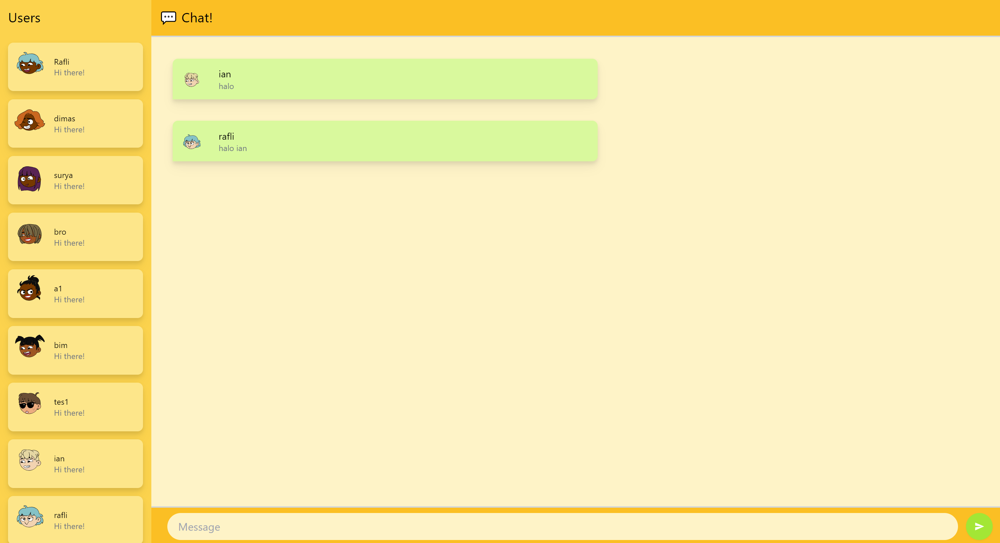

# Tutorial 10: YewChat

### 3.1 Original Code

Screenshot menggunakan aplikasi chat dengan dua user.

### 3.2 Creativity

Di sini, saya menambahkan kembali avatar untuk tiap user-nya. Selain itu, saya juga mengubah color palette dari elemen-elemen UI-nya.